# Marine-Litter-Manager

<table border ="0">
 <tr>
  <td valign="top">
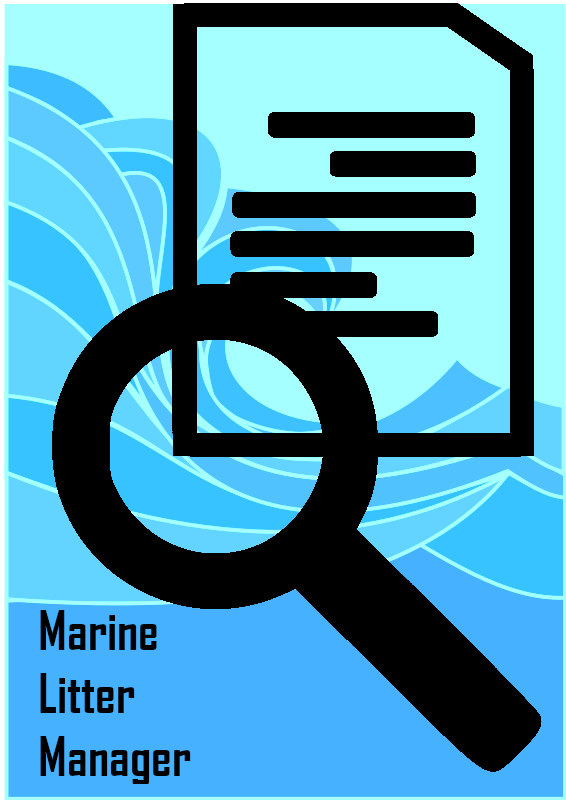 
  </td>

  <td>
Marine Litter Manager (MLM) is a Python data formatting tool that can be used to generate:

   
<ul>
  <li>EMODnet beach litter format</li>
  <li>EMODnet seafloor trawlings litter format</li>
</ul>
This is done following the specifications of the official guidelines published by EMODnet Chemistry ( https://www.emodnet-chemistry.eu/ ). It is available for Linux and Windows. 
   
   
The software is available for download at the following link: https://www.emodnet-chemistry.eu/marinelitter/manager
   
The user manual is available at the following link: https://doi.org/10.13120/21addf37-7e82-4a55-b040-3d3d87115ac0

   
The specific video tutorials are available at the following link:
https://www.emodnet-chemistry.eu/help/littervideotutorial
   
   
Available functions:
<ol>
<li>
Seafloor Litter formatting
</li>
<li>
Beach Litter formatting
</li>
<li>
The surveys plots (for both litter standards)
</li>
<li>
The params plots (for both litter standards)
</li>
<li>
Dictionary search engine
</li>
<li>
Links 
</li>
</ol>   
   
</td>
  </tr>
 </table>

# Screenshots

<table border ="0">
 <tr>
  <td colspan="2">
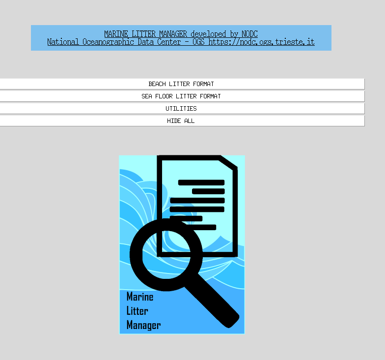
  </td>
  </tr>
 <tr>
  <td>
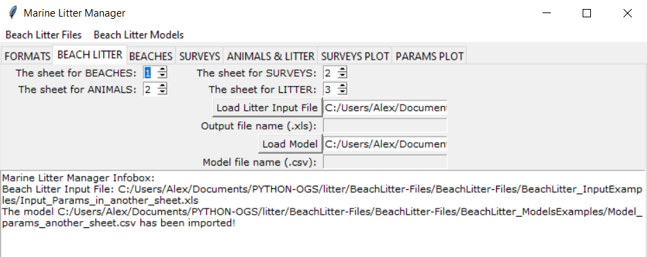
  </td>
  <td>
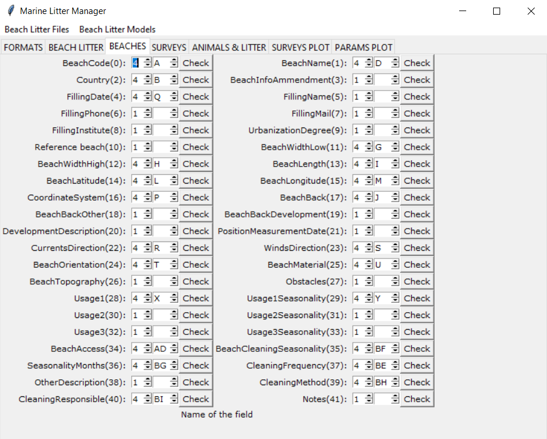
  </td>
  </tr>
  <tr>
  <td>
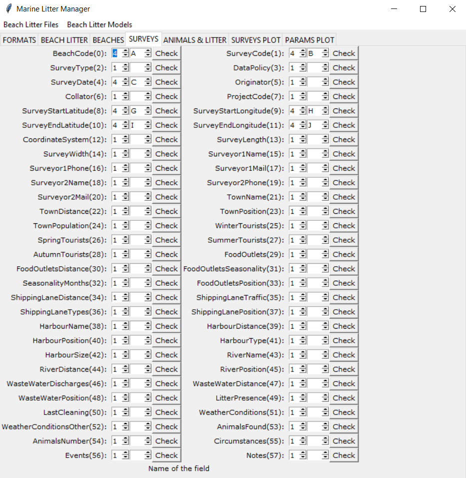
  </td>
  <td>
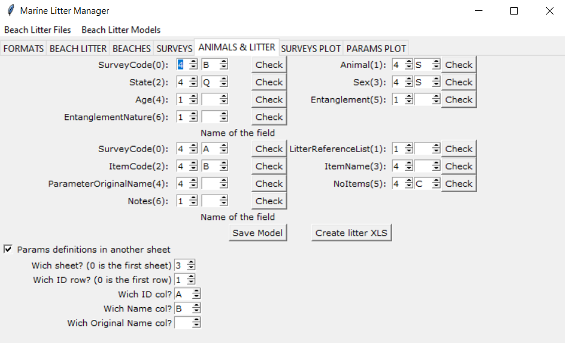
  </td>
  </tr>
  <tr>
  <td>
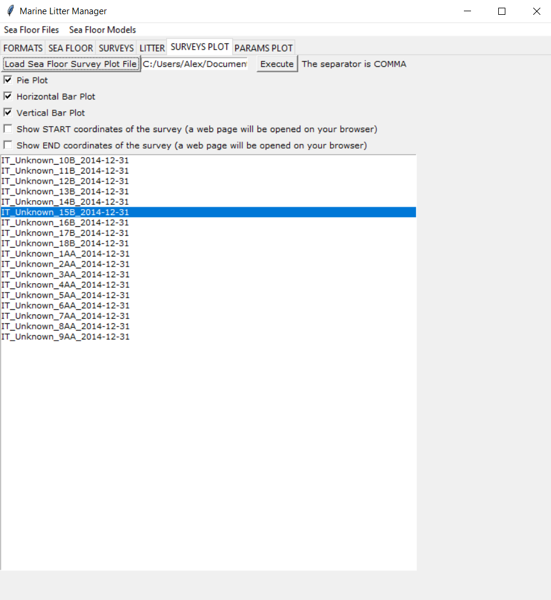
  </td>
  <td>
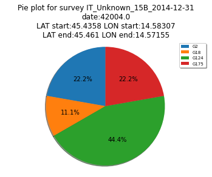
  </td>
  </tr>
  <tr>
  <td>
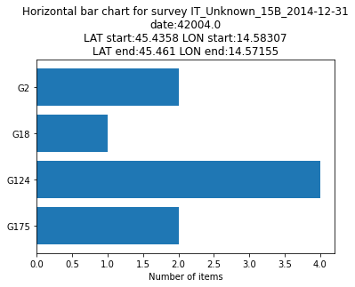
  </td>
  <td>
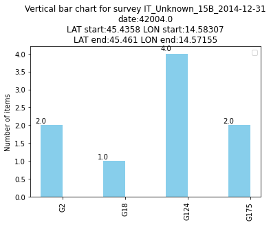
  </td>
  </tr>
  <tr>
  <td>
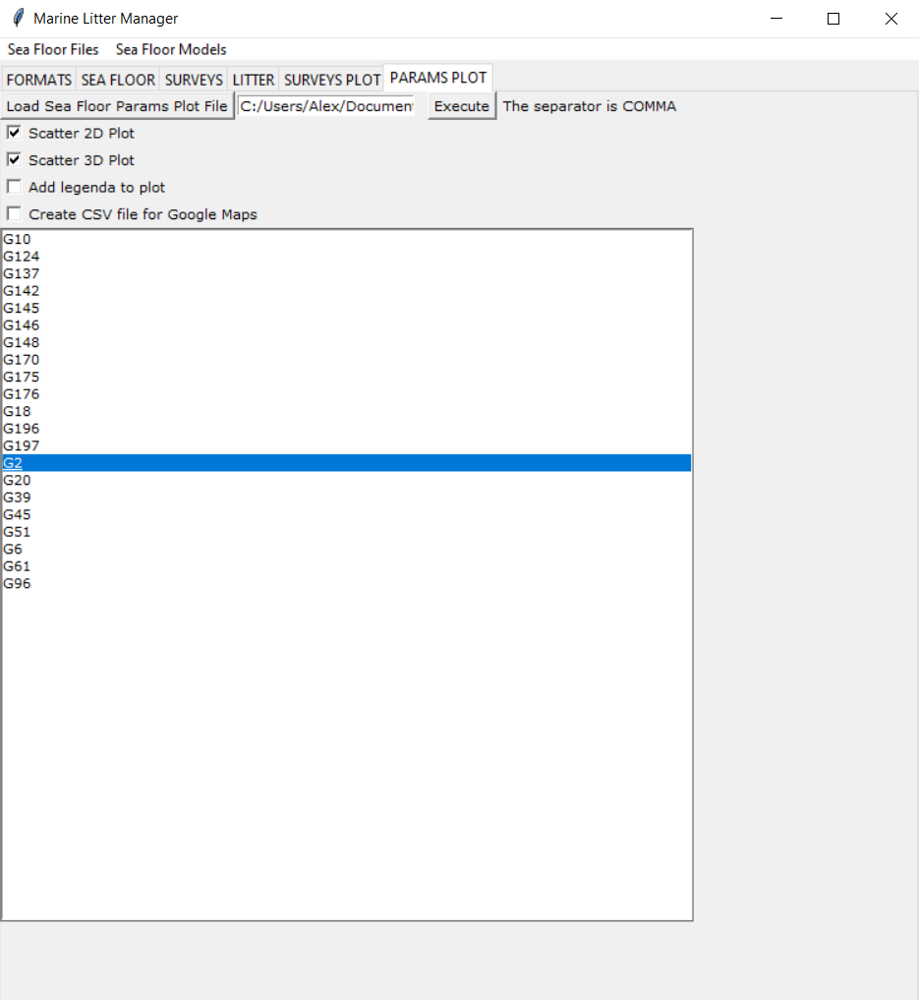
  </td>
  <td>
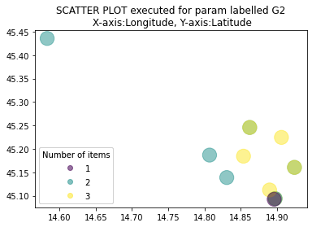
  </td>
  </tr>
  <tr>
  <td>
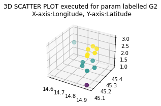
  </td>
  <td>
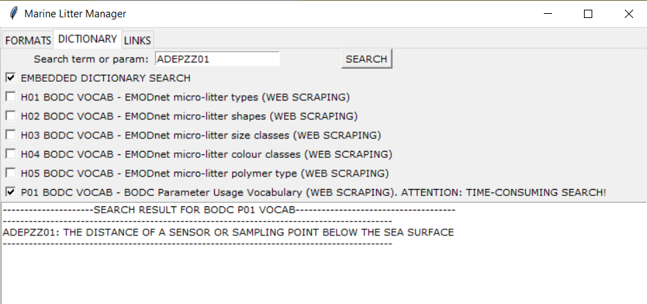
  </td>
  </tr>
 </table>

# How To create an exe (Linux/Windows):
<ol>
<li>
https://pypi.org/project/auto-py-to-exe/
 
pip install auto-py-to-exe
 
auto-py-to-exe
</li>
<li>
add the following files: legenda.txt, logo.png
</li>
<li>
To include the MLM logo use the following option inside auto-py-to-exe:
 
--hidden-import='PIL._tkinter_finder'
</li>
<li>
FOR WINDOWS ONLY, with ANACONDA:
 
--exclude-module scikit-learn,PyQt5,PyQt4,2to3,IPython,Jinja2,pycparser,scipy
 </li>
</ol>

